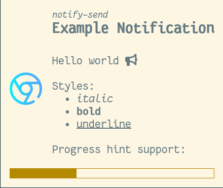

[](https://ci.codeberg.org/dnkl/fnott)

# Fnott

Fnott is a keyboard driven and lightweight notification daemon for
wlroots-based Wayland compositors.

It implements (parts of) the [Desktop Notifications Specification](https://specifications.freedesktop.org/notification-spec/latest/).

[](https://repology.org/project/fnott/versions)


Supports styling and progress hints:



Notifications are automatically sized (with the possibility of
limiting their max width and height):


## Supported features

* Summary
* Body
* Actions (requires a dmenu-like utility to display and let user select action)
* Urgency
* Icons
  - PNGs (using libpng)
  - SVGs (using bundled [nanosvg](https://github.com/memononen/nanosvg))
* Markup
* Timeout

More documentation is available in the installed man pages:

 * [man fnott](./doc/fnott.1.scd) documents the server
 * [man fnottctl](./doc/fnottctl.1.scd) documents the client
 * [man fnott.ini](./doc/fnott.ini.5.scd) documents the configuration

## Requirements

### Running

* fontconfig
* freetype
* pixman
* libpng
* wayland (_client_ and _cursor_ libraries)
* wlroots\*
* dbus
* [fcft](https://codeberg.org/dnkl/fcft), _unless_ built as a subproject

\* Fnott must be run in a Wayland compositor that implements the
wlroots protocols.

### Building

In addition to the dev variant of the packages above, you need:

* meson
* ninja
* scdoc
* wayland-protocols
* [tllist](https://codeberg.org/dnkl/tllist), _unless_ built as a subproject


## Usage

Copy the example `fnott.ini` to `${HOME}/.config/fnott/fnott.ini` and
edit to your liking.

Start the daemon by running `fnott`. Keep in mind that your environment
should start it automatically when a notification is emitted.

if your environment doesn't do it automatically,
you need to start a `dbus` session yourself:

```sh
dbus-daemon --session --address=unix:path=$XDG_RUNTIME_DIR/bus
```

Test it with e.g. `notify-send "this is the summary" "this is the body"`.

Use `fnottctl dismiss` to dismiss the highest priority notification
(usually the oldest), `fnottctl dismiss all` to dismiss **all**
notifications, or `fnottctl dismiss <id>` to dismiss a specific
notification (use `fnottctl list` to list currently active
notifications).

Use `fnottctl pause` to disable notifications. `fnottctl unpause` will
re-enable notifications.

Additionally if you compositor implements either the KDE idle
protocol, or the newer idle-notify protocol, fnott will not dismiss
any notification if you are idle by the amount of time configured in
`fnott.ini`

You can also click on a notification to dismiss it.

Note: you probably want to bind at least `fnottctl dismiss` to a
keyboard shortcut in your Wayland compositor configuration.


## Installation

To build, first, create a build directory, and switch to it:
```sh
mkdir -p bld/release && cd bld/release
```

Second, configure the build (if you intend to install it globally, you
might also want `--prefix=/usr`):
```sh
meson --buildtype=release ../..
```

Three, build it:
```sh
ninja
```

You can now run it directly from the build directory:
```sh
./fnott
```

Test that it works:
```sh
notify-send -a "MyApplicationName" "This Is The Summary" "hello world"
```

Optionally, install it:
```sh
ninja install
```

## License

Fnott is released under the [MIT license](LICENSE).

Fnott uses nanosvg, released under the [Zlib
license](3rd-party/nanosvg/LICENSE.txt).


# Sponsoring/donations

* Liberapay: https://liberapay.com/dnkl
* GitHub Sponsors: https://github.com/sponsors/dnkl

[](https://liberapay.com/dnkl/donate)
